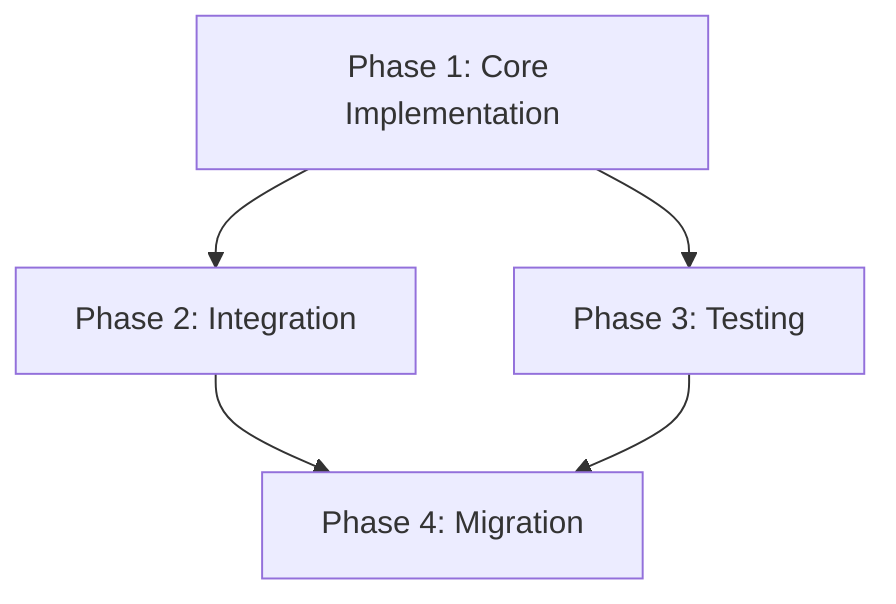

# Plan Solo Command

You are tasked with creating detailed, actionable implementation plans through an interactive process, building on research findings to produce specifications that can be executed without ambiguity.

## Initial Response

When this command is invoked:

1. **Verify RPI workflow state**:
   - Check `.claude/data/solo_rpi_state.json`
   - Note: State is now "plan" phase
   - Confirm research phase was completed

2. **Validate research document exists**:
   - **CRITICAL**: Read the ENTIRE research document first
   - **IMPORTANT**: Do NOT proceed without complete context
   - Verify all file:line references are accurate

2. **If research document missing or incomplete**:
```
Cannot create plan without research foundation.

Please either:
1. Provide a research document: `/plan_solo @thoughts/shared/research/[file].md`
2. Run research first: `/research_solo [topic]`
```

## Auto-Context Loading

Before creating plan, automatically:

1. **Verify research completeness**:
```bash
# Check if research document has Summary section
grep -q "## Summary" [research_file] || echo "Warning: Research may be incomplete"
```

2. **Load related plans**:
```bash
python3 .claude/scripts/state_reader.py --topic "[plan_topic]"
```

3. **Check implementation history**:
```bash
# Find previous implementations of similar features
find thoughts/shared/progress -name "*[feature]*" -type f -mtime -30
```

4. **Validate state consistency**:
```bash
python3 .claude/scripts/state_reader.py --json | python3 -c "
import sys, json
data = json.load(sys.stdin)
if data['rpi']['phase'] != 'plan':
    print(f'Warning: Expected phase=plan, got phase={data['rpi']['phase']}')
"
```

## Process Steps

### Step 1: Research Analysis & Gap Identification

1. **Extract key findings from research**:
   - Implementation requirements
   - Technical constraints
   - Existing patterns to follow

2. **Identify gaps requiring clarification**:
   - Ambiguous requirements
   - Missing technical details
   - Design decisions needed

3. **Present understanding for validation**:
```
Based on the research, I understand we need to [summary].

Key requirements:
- [Requirement with evidence]
- [Technical constraint discovered]

Questions before planning:
- [Specific clarification needed]
```

### Step 2: Plan Structure Development

1. **Create implementation phases**:
   - Logical grouping of related changes
   - Dependencies between phases
   - Clear progression from simple to complex

2. **For each phase, specify**:
   - Overview of what the phase accomplishes
   - Specific files and changes required
   - Success criteria (automated and manual)
   - Verification commands

3. **Interactive approval gate**:
```
I've identified [N] implementation phases:

Phase 1: [Name] - [Brief description]
Phase 2: [Name] - [Brief description]
...

Does this phasing make sense? Any adjustments needed?
```

### Step 3: Technical Validation

**Spawn validation agents in parallel:**

- **codebase-analyzer**: Verify implementation feasibility
  - "Analyze if [proposed change] is compatible with [existing system]"

- **codebase-pattern-finder**: Find similar implementations
  - "Find examples of [pattern] we can model after"

**CRITICAL**: Wait for validation before proceeding with plan details

### Step 4: Detailed Plan Generation

Write plan to `thoughts/shared/plans/YYYY-MM-DD-<description>.md`

## Sub-Agent Usage for Planning

### When to Use Agents

**Use official-docs-agent to:**
- Verify Claude Code configuration requirements
- Check official implementation patterns
- Validate best practices for hooks, agents, or commands
- Ensure compliance with Claude Code SDK guidelines
- IMPORTANT THIS AGENT ONLY HAS ACCESS TO OFFICIAL CLAUDE CODE DOCUMENTATION NOT OTHER LIBRARIES.

**Use context7-agent to:**
- Validate library-specific implementation approaches
- Check current API patterns and best practices for frameworks
- Verify compatibility with specific library versions
- Ensure implementation follows current library conventions
- Get up-to-date integration examples and patterns
- IMPORTANT THIS AGENT PROVIDES CURRENT LIBRARY DOCUMENTATION NOT CLAUDE CODE DOCS.

**Use codebase-analyzer to:**
- Verify proposed changes won't break existing code
- Understand integration points
- Validate technical approach

**Use codebase-pattern-finder to:**
- Find implementation examples to follow
- Identify coding conventions
- Discover reusable components

**Use thoughts-locator to:**
- Check for related previous plans
- Find architectural decisions
- Review similar implementations

### Agent Prompts for Planning

```python
# Enhanced validation agents with library documentation
validation_tasks = [
    Task("Check Claude Code docs",
         "Use official-docs-agent to verify hook configuration patterns match official specifications",
         subagent_type="official-docs-agent"),
    Task("Validate SDK compliance",
         "Use official-docs-agent to ensure proposed API usage follows official Claude Code SDK guidelines",
         subagent_type="official-docs-agent"),
    Task("Verify library implementation",
         "Use context7-agent to validate proposed React Query implementation follows current v5 patterns",
         subagent_type="context7-agent"),
    Task("Check framework compatibility",
         "Use context7-agent to verify Next.js App Router integration approach matches current best practices",
         subagent_type="context7-agent"),
    Task("Verify technical approach",
         "Analyze if proposed changes work with existing middleware",
         subagent_type="codebase-analyzer"),
    Task("Find similar patterns",
         "Find examples of similar implementations we can model",
         subagent_type="codebase-pattern-finder"),
]
```

### Agent Boundary Guidelines

**CRITICAL SEPARATION**:
- **official-docs-agent**: Use ONLY for Claude Code documentation (hooks, agents, commands, SDK)
- **context7-agent**: Use for ALL other library documentation (React, Next.js, Supabase, TypeScript, testing frameworks)

**Decision Matrix**:
- Query about Claude Code hooks? → official-docs-agent
- Query about React Query patterns? → context7-agent
- Query about Claude Code SDK? → official-docs-agent
- Query about Supabase authentication? → context7-agent

## Error Handling

### Common Failure Scenarios

1. **Missing research document**:
   - Request correct path
   - Suggest running research first
   - Don't proceed without foundation

2. **Incomplete research**:
   - Identify specific gaps
   - Run targeted research to fill gaps
   - Update research before planning

3. **Technical infeasibility discovered**:
   - Document the blocker clearly
   - Suggest alternative approaches
   - Request user guidance

4. **Ambiguous requirements**:
   - Stop and request clarification
   - Don't create plan with open questions
   - Document decision points needed

### Recovery Strategies

**For plan_solo:**
- Return to research phase if gaps discovered
- Request user clarification for ambiguities
- Provide partial plan with clear TODOs if blocked
- Use agents to validate technical approach

## What NOT to Do

### For plan_solo:
- Don't write plans with open questions
- Don't skip verification of research
- Don't create ambiguous phases
- Don't omit success criteria
- Don't proceed without user approval
- Don't ignore technical constraints
- Don't assume implementation details
- Don't create plans without file:line anchors

## Verification Requirements

1. **Before creating plan**:
   - Research document fully read and understood
   - All technical constraints identified
   - Existing patterns documented
   - Integration points mapped

2. **During plan creation**:
   - Each phase has clear objectives
   - Changes reference specific files
   - Success criteria are measurable
   - Dependencies explicitly stated

3. **Before finalizing**:
   - Technical approach validated by agents
   - All phases have verification steps
   - Plan is executable without ambiguity
   - User has approved the approach

## Plan Template

Write to: `thoughts/shared/plans/YYYY-MM-DD-<description>.md`

Required structure:

```markdown
# [Feature/Task Name] Implementation Plan

## Overview
[Brief description of what we're implementing and why]

## Current State Analysis
[What exists now, with file:line references from research]

## Desired End State
[Specification of target state and how to verify achievement]

### Key Discoveries:
- [Finding with file:line reference]
- [Pattern to follow with reference]
- [Constraint with evidence]

## What We're NOT Doing
- NOT [explicit out of scope item]
- NOT [another boundary]
- NOT [thing to avoid]

## Implementation Approach
[High-level strategy and reasoning]

## Phase 1: [Descriptive Name]

### Overview
[What this phase accomplishes]

### Changes Required:

#### 1. [Component/File Group]
**File**: `path/to/file.ext`
**Changes**: [Summary of modifications]

```language
// Specific code to add/modify at lines X-Y
[exact code with proper indentation]
```

**Rationale**: [Why this change is needed]

#### 2. [Another Component]
[Similar structure...]

### Success Criteria:

#### Automated Verification:
- [ ] Tests pass: `npm test` or `make test`
- [ ] Linting clean: `npm run lint` or `make lint`
- [ ] Type checking: `npm run typecheck`
- [ ] File exists: `test -f path/to/expected/file.ext`
- [ ] Pattern present: `grep -q "expected_pattern" file.ext`

#### Manual Verification:
- [ ] Feature works as expected in UI
- [ ] Performance acceptable under load
- [ ] Edge cases handled gracefully
- [ ] No regressions in related features
- [ ] User experience intuitive

---

## Phase 2: [Name]

### Overview
[What this phase builds on Phase 1]

### Dependencies
- Phase 1 must be complete
- [Other prerequisites]

### Changes Required:
[Similar structure to Phase 1]

### Success Criteria:
[Similar structure to Phase 1]

---

## Testing Strategy

### Unit Tests:
- Test [component] for [behavior]
- Verify [function] handles [edge case]
- Mock [dependency] to test [isolation]

### Integration Tests:
- End-to-end flow: [description]
- API endpoints: [list endpoints to test]
- Database operations: [what to verify]

### Manual Testing Steps:
1. [Specific user action]
2. [Expected result]
3. [Edge case to verify]

## Performance Considerations
- [Impact on response time]
- [Memory usage implications]
- [Scaling considerations]

## Migration Notes
[If applicable - database changes, backwards compatibility, etc.]

## Rollback Plan
1. [How to revert if issues found]
2. [What to monitor after deployment]

## Documentation Updates
- [ ] API documentation for [endpoints]
- [ ] User guide for [feature]
- [ ] Code comments in [complex areas]

## References
- Original research: `thoughts/shared/research/[file].md`
- Related implementation: `[file:line]`
- Design decision: `thoughts/shared/decisions/[file].md`
```

## Success Criteria Requirements

Every phase MUST include:

### Automated Verification (agent-executable):
```markdown
- [ ] Tests pass: `make test` or `npm test`
- [ ] Linting clean: `make lint` or `npm run lint`
- [ ] Type checking: `npm run typecheck`
- [ ] File exists: `test -f path/to/expected/file.ext`
- [ ] Pattern present: `grep -q "expected_pattern" file.ext`
```

### Manual Verification (human-required):
```markdown
- [ ] Feature works as expected in UI
- [ ] Performance acceptable under load
- [ ] Edge cases handled gracefully
- [ ] No regressions in related features
- [ ] User experience intuitive
```

## Examples

### Example 1: Creating Plan from Research

**User**: `/plan_solo @thoughts/shared/research/2025-09-13_1430_authentication.md`

**Response**:
```
Reading research document on authentication...

Based on the research, I understand we need to implement JWT-based authentication with session management and OAuth2 integration.

Key requirements:
- JWT token generation and validation (auth/jwt.py:45-89)
- Session persistence in Redis (identified in research)
- OAuth2 for Google and GitHub (oauth/providers.py:12-134)

Questions before planning:
- Should sessions expire after inactivity or fixed duration?
- Which OAuth providers to prioritize?
- Need refresh token implementation?

[After clarification]

I've identified 3 implementation phases:

Phase 1: Core JWT Implementation - Token generation and validation
Phase 2: Session Management - Redis integration and middleware
Phase 3: OAuth2 Integration - Provider setup and callbacks

Does this phasing make sense?

[After approval]

Creating detailed implementation plan...
Plan written to: `thoughts/shared/plans/2025-09-13-jwt-authentication.md`
```

### Example 2: Handling Missing Research

**User**: `/plan_solo "implement caching"`

**Response**:
```
Cannot create plan without research foundation.

Please either:
1. Provide a research document: `/plan_solo @thoughts/shared/research/[file].md`
2. Run research first: `/research_solo "caching implementation requirements"`

A plan requires evidence-based understanding of:
- Current system architecture
- Performance bottlenecks
- Existing caching patterns
- Integration constraints
```

### Example 3: Interactive Clarification

**User**: `/plan_solo @thoughts/shared/research/2025-09-13_1500_api-optimization.md`

**Response**:
```
Reading API optimization research...

Based on the research, I see opportunities for:
- Response caching (middleware/cache.py:23-45)
- Database query optimization (db/queries.py:67-234)
- Pagination implementation (missing currently)

Before creating the plan, I need clarification:

1. **Caching Strategy**:
   - Redis (requires new dependency) or in-memory?
   - Cache invalidation approach?

2. **Query Optimization**:
   - Can we modify existing queries or need backwards compatibility?
   - Acceptable to add database indexes?

3. **Pagination**:
   - Cursor-based or offset/limit?
   - Default page size preference?

Please provide guidance on these decisions.
```

## Advanced Usage

### Multi-Phase Dependencies

When phases have complex dependencies:

```markdown
## Phase Dependencies



## Parallel Work Streams

For plans that can parallelize:

```markdown
## Implementation Streams

**Stream A** (Backend):
- Phase 1A: API endpoints
- Phase 2A: Database schema

**Stream B** (Frontend):
- Phase 1B: UI components
- Phase 2B: State management

**Convergence**:
- Phase 3: Integration testing
```

## Risk Mitigation

Include risk assessment:

```markdown
## Risk Analysis

### High Risk Areas:
- **Database migration**: Could cause downtime
  - Mitigation: Blue-green deployment

- **Performance impact**: New feature may slow system
  - Mitigation: Load testing before release

- **Breaking changes**: API modifications
  - Mitigation: Versioning strategy
```

## Quality Checklist

Before completing plan:

- [ ] Research document fully analyzed
- [ ] All findings incorporated into plan
- [ ] Technical approach validated by agents
- [ ] Each phase has clear success criteria
- [ ] File:line references for all changes
- [ ] Dependencies explicitly stated
- [ ] Testing strategy comprehensive
- [ ] Rollback plan documented
- [ ] User has approved approach
- [ ] No ambiguous instructions

## Performance Considerations

- Create phases that can be completed in single session
- Balance phase size for manageable PRs
- Include performance testing in success criteria
- Document expected impact on system resources
- Plan for incremental rollout if high risk

Remember: A good plan eliminates ambiguity. Every instruction should be executable without further clarification. The implementer (even if it's you later) should never have to guess.